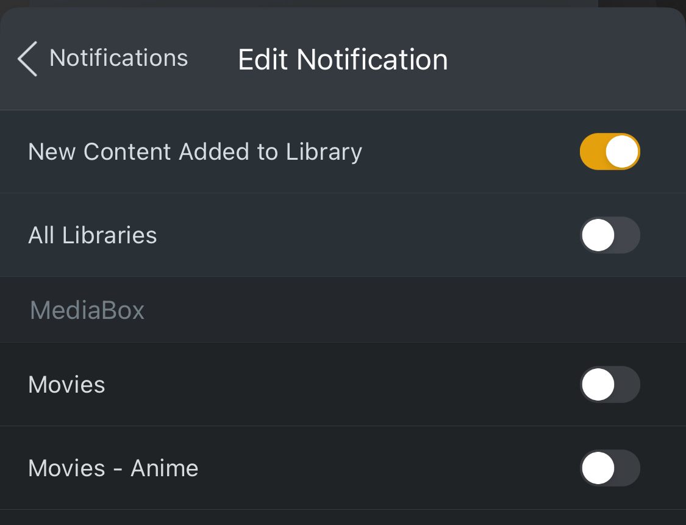

# Plex Watchlist Notify

This script will send  push notifications to a user plex app when content is avaiable from the user watchlist.
This also works for the users friends.

Note: You need to be the servers admin to make this work.

# Installation

### Run as a service

```yml
version: "3"
services:
  plexnotify:
    image: ghcr.io/lostb1t/plexnotify
    environment:
      - PLEX_TOKEN=YOURTOKWN
    ports:
      - 8000:8000
    restart: unless-stopped
```

### Add webhook

Add the service webhook url to the plex webhooks. Ex: http://10.0.1.7:8000/webhooks/plex.  
You can add plex webhooks at https://app.plex.tv/desktop/#!/settings/webhooks

Make sure you have enabled "Push notifcations" under the general server settings tab aswell

### Enable notifications in app

To receive notifications in the plex app goto settings -> notifications and enable "New content added to library"
Disable the "All libraries" toggle and dont select any individual libraries. Ofcourse you can also keep these options enabled if you want.



Profit!